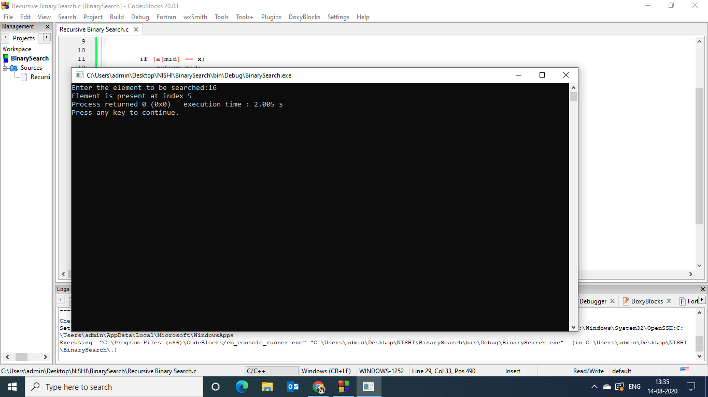
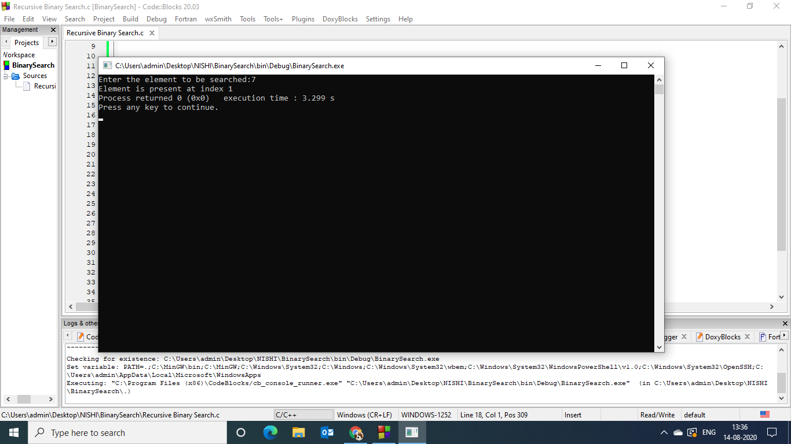
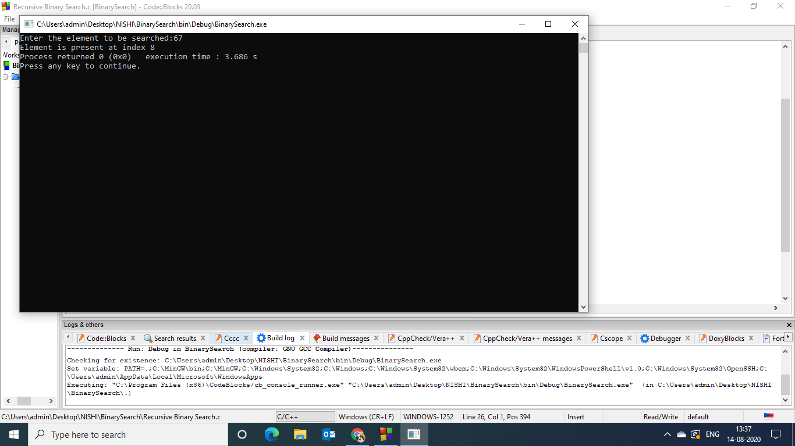

### Aim of the experiment:
Write a program using Recursive functions to perform the following searching operations for a Key value in a given list of integers:
1) Binary Search
### Description:
 Binary Search :
- It starts by testing the data in the element at the middle of the list.
 This determines if the target is in first half or second half of the list.
 If it is in first half , we do not need to check the second half.
 If it is in second half , we do not need to check the first half.
 In other words ,either way we eliminate half the list from further
 consideration
- In this search ,elements in the list need to be ordered.
- This type of search takes less time to execute
### Step by step procedure:
- We have the array {11,7,9,16,21,4,15,98,67,31}
- In Binary Search we need to sort the array
- After sorting we have the array { 4,7,9,11,15,16,21,31,67,98}
- We need to find the mid value which is the value at sum of initial and last index divided by 2
- We need to compare the key value and mid value by calling the user function declared
- If the key value and the mid value are same it returns the mid value with the index
- If the key value is less than mid value search the upper half of the array,if the key value is greater than mid value search the lower half of the array by recursively calling the function until the key value = mid value.
- If the key value is not  found it returns Element not found to the output.
- In output 1 the key value is 16
- We declare a Function RecursiveLinearSearch
- The mid value is 15
- The key value > mid value hence we search the upper half of the array by recursivey calling the function
- We start search from 16
- Key value = Mid Value
- Returns Element found with index

### Output obtained:
- Output 1 Key : 16

- Output 2 Key : 7

 
 
 - Output 3 Key : 67
 
 
