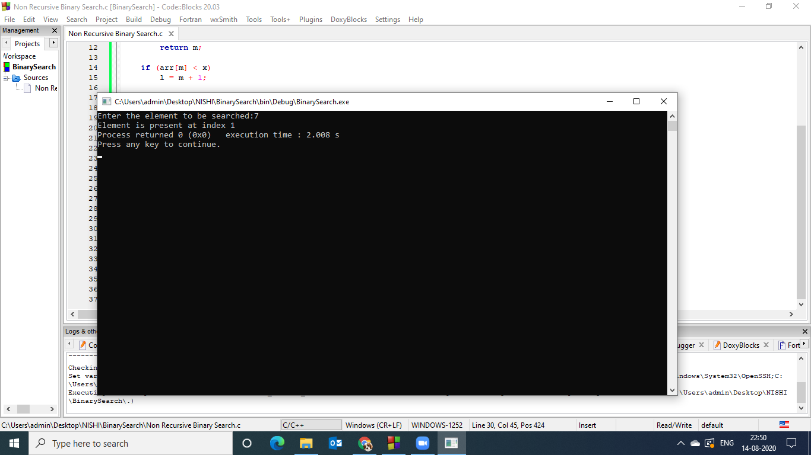
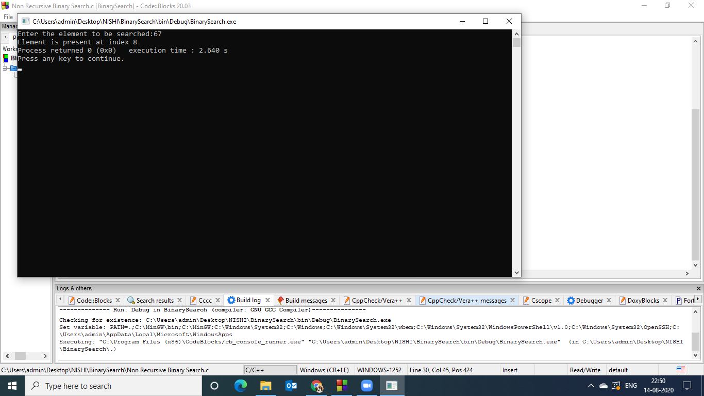

### Aim of the experiment:
Write a program using non-recursive functions to perform the following searching operations for a Key value in a given list of integers:
-Binary Search
### Description:
Binary Search :

It starts by testing the data in the element at the middle of the list. This determines if the target is in first half or second half of the list. If it is in first half , we do not need to check the second half. If it is in second half , we do not need to check the first half. In other words ,either way we eliminate half the list from further consideration
In this search ,elements in the list need to be ordered.
This type of search takes less time to execute

### Step by step Procedure:

### Output Obtained:
- Output 1 Key value 16: 

- Output 2 Key Value 7:

- Output 3 Key Value 67 :

