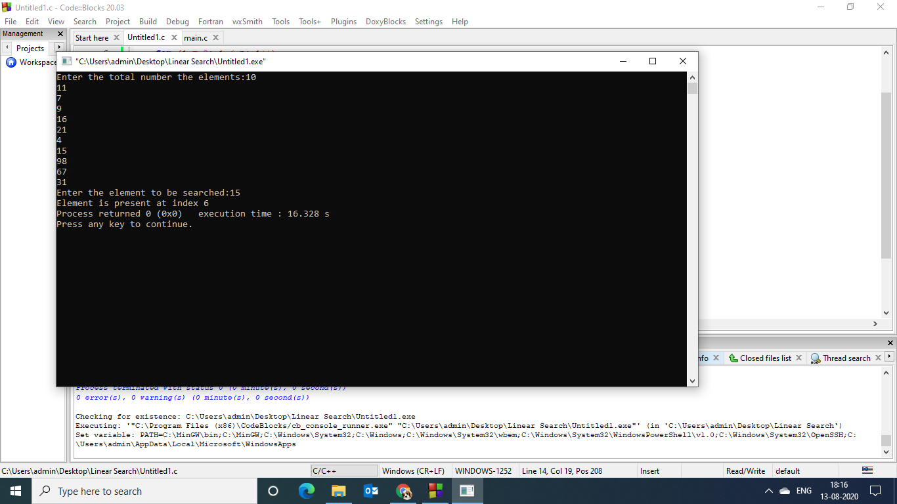
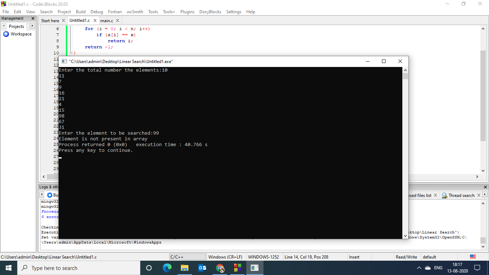

## Aim of the experiment:
Write a program using non-recursive functions to perform the following searching operations for a Key value in a given list of integers:
1) Linear Search
### Description:
1) Linear Search : 
- It is also known as sequential search .we start searching for the target from the
 beginning of the list, and we continue until  we find the target or
 until we are sure that it is not in the list.
- In this search, elements in the list need not be ordered.

### Step by Step procedure:
- We have declared a function LinearSearch which takes in 3 input parameters 
- Initialize a for loop and check if the element and the key value are same ,if the value of the element and the key value are same the for loop returns the index of the element else it returns -1.This is done in the LinearSearch function.
- In the main function we read the size of the array and then the elements in the array by initializing a for loop.
- Next we read the key value.
- In the main function we call the LinearSearch function and check where the value is found and print the value found with the index.
- In case we do not find the value we print element not found to the output.

# Output:
- Output 1 Key Value:15

- Output 2 Key Value:99

 

