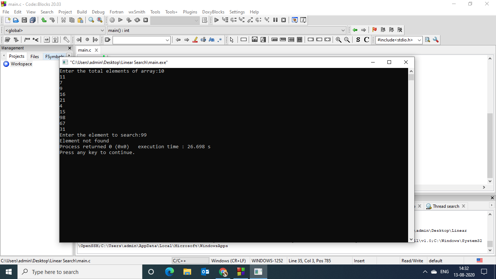
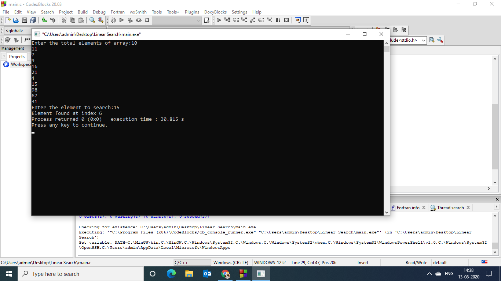

### Aim of the experiment:
Write a program using recursive functions to perform the following searching operations for a Key value in a given list of integers:
- Linear Search
### Description:
Linear Search :
- It is also known as sequential search .we start searching for the target from the beginning of the list, and we continue until we find the target or until we are sure that it is not in the list.
- In this search, elements in the list need not be ordered.
### Step by step procedure:
- We have the array {11,7,9,16,21,4,15,98,67,31}
- For output 2 the key element we need to search is 15
- We declare a function RecursiveLinearSearch 
- We initialize a for loop and check if the element is equal to the key value by recursively calling the function 
- When the key = Element 
  it returns Element found with index , If not found it prints Element not found .

### Output obtained:
- Output 1 Key Value : 99
 

- Output 2 Key Value : 15

