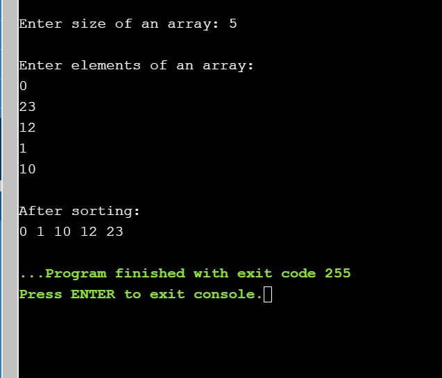
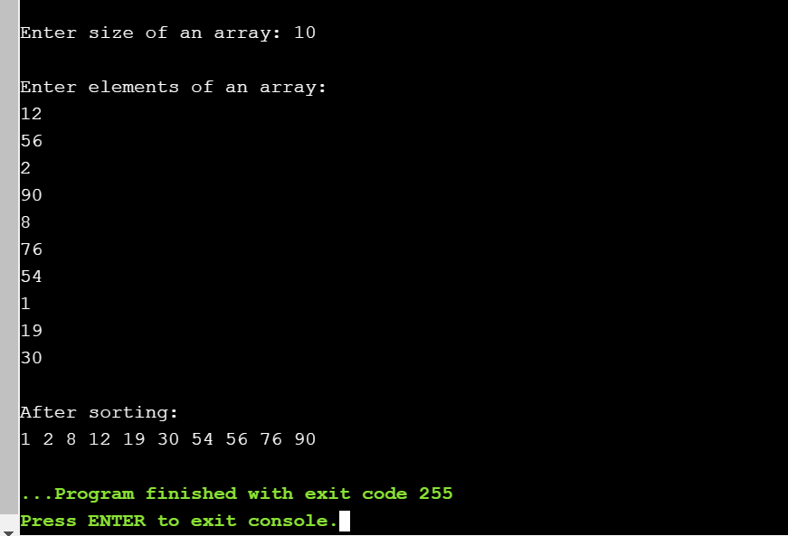
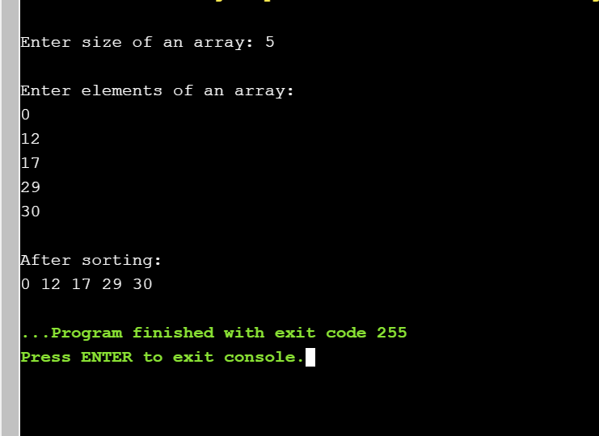

# Selection Sort
## Aim of the experiment
Write a program that implements selection sorting method to sort a given list of integers in ascending order
## Description
### Selection sort(in-place sorting,cocktile sorting)
- Selection sort is a sorting algorithm, specifically an in-place comparison sort.
- Generally performs worse than the similar insertion sort.
- Selection sort is noted for its simplicity, and also has performance advantages over more
 complicated algorithms in certain situations, particularly where auxiliary memory is
 limited.
## Step by Step Procedure:
- Set min to the first location
− Search the minimum element in the array
- swap the first location with the minimum value in the array
- assign the second element as min.
- Repeat the process until we get a sorted array.

## Output

